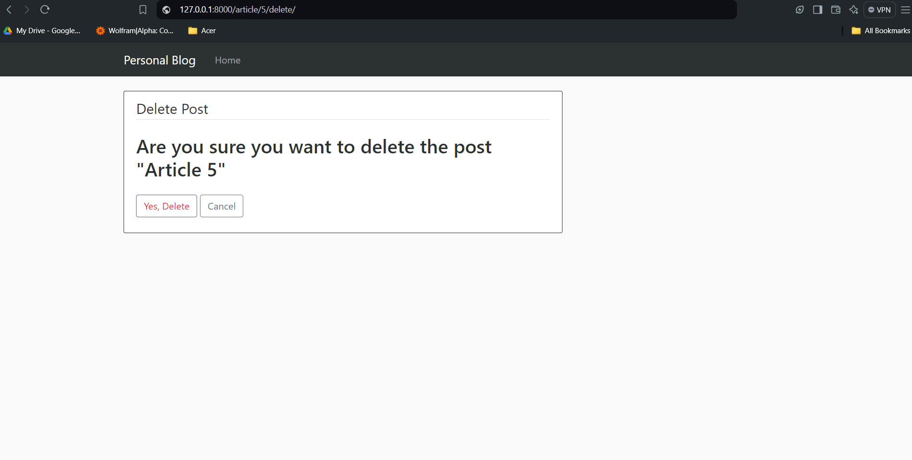

## Personal Blog


## Features
- Guest Section — A list of pages that can be accessed by anyone:
  -Home Page: This page will display the list of articles published on the blog.
  
- Admin Section — are the pages that only you can access to publish, edit, or delete articles.
  - Dashboard: This page will display the list of articles published on the blog along with the option to add a new article, edit an existing article, or delete an article.
  - Add Article Page: This page will contain a form to add a new article. The form will have fields like title, content, and date of publication.
  - Edit Article Page: This page will contain a form to edit an existing article. The form will have fields like title, content, and date of publication.

  
## Installation
```bash
git clone https://github.com/nourel25/Unit-Converter.git
```

## Images
### Home


### DashBoard


### Add a New Article


### Delete an Article



